# Architecture

How the codebase is put together: which file owns what, how the files call
each other, and how a GPX file becomes a FIT file. This assumes you know what
the app does (see [README.md](../README.md)). The calibration harness in
`tuning/` has its own document,
[TUNING_ARCHITECTURE.md](TUNING_ARCHITECTURE.md). Diagrams are Mermaid,
which GitHub renders. In PyCharm, enable Mermaid in *Settings → Languages &
Frameworks → Markdown*.

Contents

1. [Design rules](#1-design-rules)
2. [Repository map](#2-repository-map)
3. [System overview](#3-system-overview)
4. [The data contract: `models.py`](#4-the-data-contract-modelspy)
5. [`core/` module by module](#5-core-module-by-module)
6. [The bridge: `pyodideBridge.js`](#6-the-bridge-pyodidebridgejs)
7. [The GUI](#7-the-gui)
8. [End-to-end code flow](#8-end-to-end-code-flow)
9. [Errors](#9-errors)
10. [The tuning harness](#10-the-tuning-harness)
11. [Tests](#11-tests)
12. [Change checklists](#12-change-checklists)

---

## 1. Design rules

These rules shape the whole codebase. Breaking one of them means
redesigning, not refactoring.

| Rule                                                                                                                                                               | Why                                                                                                                                                                                                  |
|--------------------------------------------------------------------------------------------------------------------------------------------------------------------|------------------------------------------------------------------------------------------------------------------------------------------------------------------------------------------------------|
| **`core/` does no I/O.** Every function takes and returns bytes or dataclasses, never a file path, a network call, or `print()`.                                   | `core/` runs inside Pyodide in the browser. The network calls it needs (Valhalla) are made by JS, and the results are passed in as data.                                                             |
| **`core/` doesn't know about its interface.** No HTML, no CLI parsing.                                                                                             | The GUI is the only interface today, but a CLI could be added on top of `core/` unchanged.                                                                                                           |
| **One data contract.** Every module reads and writes the types in `core/models.py`.                                                                                | No module invents its own point or track shape. Stops and photos get their own input types, but they resolve down to `Anchor`/`TrackPoint` before pacing sees them.                                  |
| **Start and end are anchors.** A known time at distance 0, at the end, at a summit, from a photo, or at a stop's arrival/departure all use the same `Anchor` type. | `combine()` has one code path: fit between consecutive anchors. The average-speed entry is also just another way to set the end anchor's time. It's converted in JS, and `core/` never sees a speed. |
| **Two-stage inputs.** `RawAnchor → Anchor`, `RawStop → ResolvedStop \| ModeAStop`, `RawPhotoAnchor → ResolvedPhotoAnchor`.                                         | "Raw" is what the frontend can know (a click position, a distance). "Resolved" is pinned to a track point. Don't merge the two stages.                                                               |
| **Derived values are computed, not cached.** `Track.total_distance`, `total_elevation_gain` and `start_time` are properties.                                       | Pacing mutates `points` in place. A cached total could silently go stale, and recomputing costs almost nothing at this data size.                                                                    |
| **`SportType` is a closed enum and a dispatch key.**                                                                                                               | `curve_selection`, `surface` and `fit_writer` branch on it. Adding cycling needs a new pacing model, not just a new enum value.                                                                      |
| **`InputError` is a user-facing contract.**                                                                                                                        | Raise it only for problems the user can fix, with a plain-language message. See [§9](#9-errors).                                                                                                     |
| **Pacing is resolved per workout, fitted per segment.**                                                                                                            | Which curve to use, how much speed may swing, and the curve exponents are decided once from the whole track. Anchors only mark where a time is known, not where the terrain changes.                 |

---

## 2. Repository map

```
src/gpx2fit/
├── core/                         pure Python, loaded into Pyodide
│   ├── models.py                 data contract (all dataclasses + enums + InputError)
│   ├── gpx_reader.py             GPX bytes → Track
│   ├── fit_writer.py             paced Track → FIT bytes
│   ├── activity_profile.py       paced Track → ~1000 ProfileSamples for the chart
│   └── pacing/
│       ├── anchors.py            nearest-point lookup, boundary + user anchors
│       ├── stops.py              stop resolution (Mode A/B), track expansion
│       ├── photo_anchors.py      EXIF readings → matched track points + status
│       ├── gradient.py           smoothed gradients, Minetti/Tobler speed curves
│       ├── curve_selection.py    per-workout: Tobler weight, speed-swing bound, curve shape
│       ├── surface.py            Valhalla response → per-leg surface multipliers
│       ├── surface_weights.json  per-sport weight tables for surface.py
│       └── combine.py            fits speeds to anchors, stamps timestamps
└── gui/
    ├── index.html                app shell; loads Leaflet, Pyodide, exifr from CDNs
    ├── about.html                static About/privacy page
    ├── styles.css                all styles, light + dark tokens
    └── js/                       plain ES modules, no build (see §7)

tuning/                           dev-only calibration harness (see TUNING_ARCHITECTURE.md)
tests/core/  tests/tuning/        pytest
tests/gui/                        node --test + jsdom
docs/                             this file and TUNING_ARCHITECTURE.md
valhalla_spike.html               standalone spike that proved Valhalla is CORS-open
```

---

## 3. System overview

Three runtime layers live in one browser tab. The tuning harness is a
separate offline tool that imports `core/` directly.

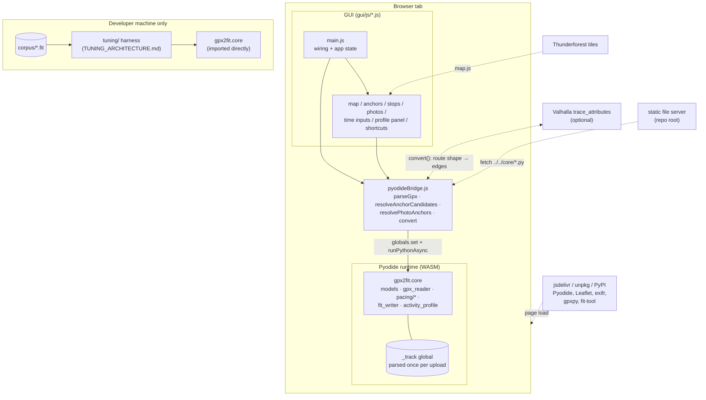

Ownership in short:

- **`main.js`** owns app state: route points, total distance, chosen sport,
  start-time result, and the GPX file name.
- **`pyodideBridge.js`** owns the Python runtime and is the only file that
  talks to Python.
- **Python** owns every calculation, including distances, nearest-point
  lookups, pacing and encoding. JS never computes a route distance itself.

---

## 4. The data contract: `models.py`

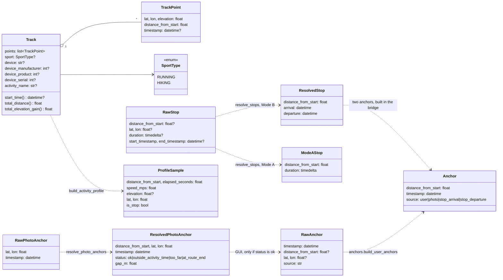

Invariants that the rest of the code relies on:

- `TrackPoint.distance_from_start` is the cumulative **3D** distance
  (gpxpy's `distance_3d`, falling back to 2D when there's no elevation). It
  never decreases. Gradients are therefore rise over slope distance.
- A missing `<ele>` inherits the previous point's elevation, and the first
  point defaults to `0.0`. `fit_writer` treats `0.0` as "no altitude".
- `timestamp` is `None` from parsing until `combine()` sets it.
- A **stop** is a pair of points at the same distance: the original point
  and a duplicate inserted right after it. The zero-distance leg between
  them is the stop's duration. `combine`, `fit_writer` and
  `activity_profile` all detect a stop with the same test: *a zero-distance
  leg that takes time*.
- Mode A stop: the user gave only a duration, and `combine()` derives the
  arrival from the pacing model. Mode B stop: the user gave explicit arrival
  and departure times, which become two `Anchor`s.

---

## 5. `core/` module by module

### 5.1 Import graph inside `core/`

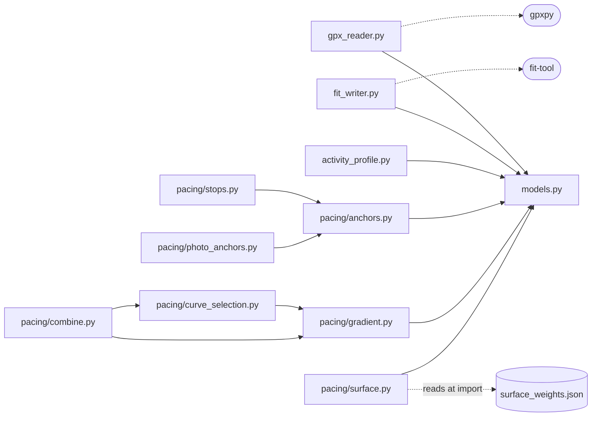

`models.py` also defines `InputError`, a subclass of `ValueError` (see
[§9](#9-errors)).

`combine.py` is the only module that brings the pacing pieces together.
`surface.py` is not imported by `combine`. The bridge calls it and passes
the resulting multipliers to `combine()` as a plain list. `anchors.py`,
`stops.py` and `photo_anchors.py` never call pacing code.

### 5.2 `gpx_reader.py`

```
parse_gpx_bytes(gpx_bytes, device=None) -> Track
  bytes ─decode utf-8─▶ gpxpy.parse ─▶ for track/segment/point:
      cumulative distance_3d (→ distance_2d) , elevation carry-forward
  ─▶ Track(points, device = device or <gpx creator>)
  raises InputError: not UTF-8 · not GPX · no track points
```

It reads only `<trk>` points. Route (`<rte>`) and waypoint elements are
ignored.

### 5.3 `pacing/anchors.py`: finding points and building anchors

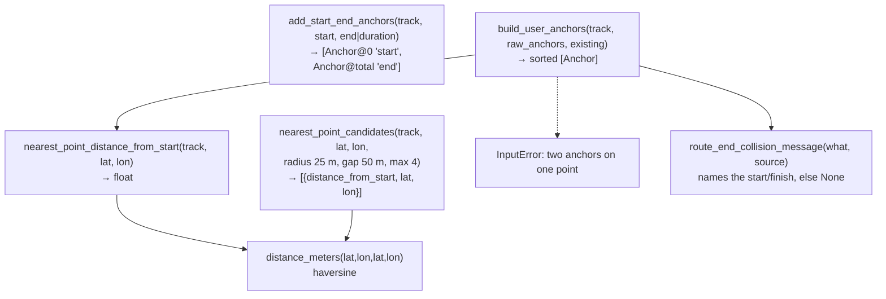

`nearest_point_candidates` is how out-and-back routes are handled. It finds
the closest point, collects every point within 25 m of it, and splits them
into clusters wherever the distance along the route jumps by more than
50 m. Each cluster is one pass of the route, and one representative per
pass is returned. A normal route always returns exactly one candidate.

### 5.4 `pacing/stops.py`

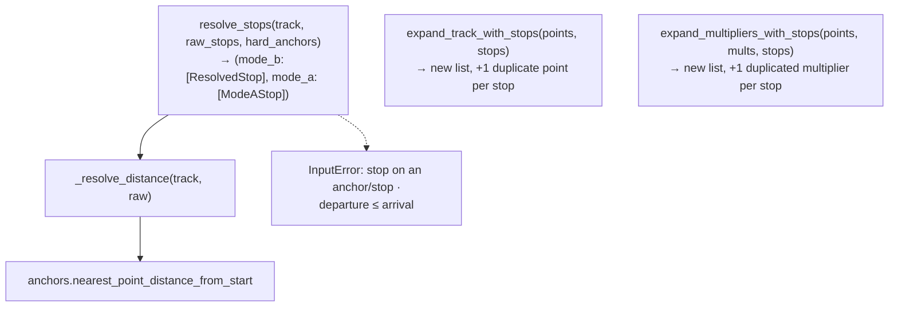

Both `expand_*` functions return new lists. `_track.points` is never
changed structurally, because the bridge reuses `_track` for every
conversion. A stop's distance must equal an existing point's distance
exactly. That's guaranteed because the GUI always sends a distance that
Python itself returned.

### 5.5 `pacing/photo_anchors.py`

```
resolve_photo_anchors(track, raw_photo_anchors, max_match 150 m,
                      activity_start?, activity_end?)
  for each photo:
     nearest_point_candidates → pick the candidate closest to the photo's GPS
     status = "outside_activity_time"  unless start < capture time < end, no padding  (checked first)
            | "too_far"                if gap > 150 m
            | "at_route_end"           if the match is the first or last point (the start/end anchors sit there)
            | "ok"
  → [ResolvedPhotoAnchor]   (never raises for a bad match; the caller decides)
```

### 5.6 `pacing/gradient.py`: terrain to relative speed

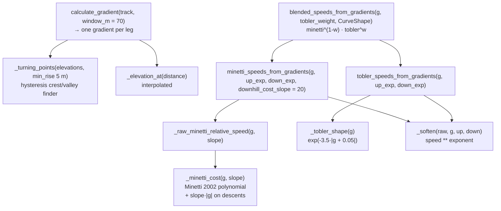

- **Window.** Each leg's gradient is rise over run across a 70 m window
  centred on the leg. Near a detected crest or valley, the window shrinks
  symmetrically so that it ends at the turning point, but not below 30 m.
  Past that limit it slides away from the turning point instead. At the
  track's ends it slides inward at full length.
- **Curves are relative.** Every curve returns 1.0 on flat ground, so every
  blend of them does too. Absolute speed comes later, when `combine` scales
  each segment to its duration.
- **Softening.** `speed ** exponent` scales log-speed linearly. That's why
  `curve_selection` can fit the exponents directly to a log-space bound.
- **Descent cost slope.** `MINETTI_DOWNHILL_COST_SLOPE` sets where Minetti's
  descents turn slower than flat. The app always uses the default; the
  `downhill_cost_slope` argument exists so the tuning harness can fit it.

### 5.7 `pacing/curve_selection.py`: three per-workout decisions

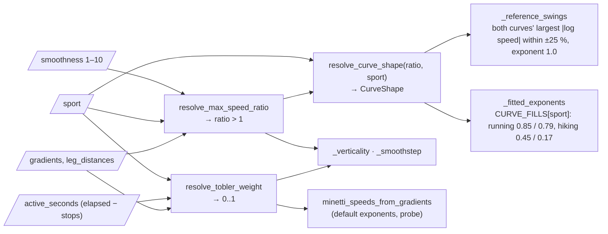

| Decision                                                      | Inputs                                    | How                                                                                                                                                                                                                                                                                                                                                                                                                             |
|---------------------------------------------------------------|-------------------------------------------|---------------------------------------------------------------------------------------------------------------------------------------------------------------------------------------------------------------------------------------------------------------------------------------------------------------------------------------------------------------------------------------------------------------------------------|
| **Tobler weight** (how much walking curve to mix in)          | flat-equivalent speed, verticality, sport | Flat-equivalent speed = `Σ(leg_distance / minetti_speed) / active_seconds`, i.e. the speed with the terrain divided out. Verticality is the distance-weighted mean `                                   \|gradient\|`. Each is ramped through a `_smoothstep` band around the sport's `TOBLER_THRESHOLDS`, and the result is the `max()` of the two. Minetti is always the probe curve.                                          |
| **Max speed ratio** (how far a leg may swing from the median) | verticality, sport, smoothness            | Ramps from `MAX_SPEED_RATIO_BOUNDS[sport].flat` to `.hilly` around `HILLY_VERTICALITY` (0.06 ± 0.04), then raised to `SMOOTHNESS_SCALES[level]`. Level 5 leaves it unchanged.                                                                                                                                                                                                                                                   |
| **Curve shape** (exponents for both curves)                   | max speed ratio, sport                    | Exponents are chosen so that each curve's largest log-speed between flat and ±25% grade equals the sport's `CURVE_FILLS` share `× log(ratio)`. For a curve that keeps slowing, that is its value at ±25%; a curve that peaks and turns back is measured at the peak, so crossing flat speed near 25% can't blow the exponent up. The curve and the bound always narrow together, and the soft clamp only has to catch outliers. |

`CURVE_FILLS`, `MAX_SPEED_RATIO_BOUNDS` and `HILLY_VERTICALITY` are fitted by
the tuning harness (2026-09-29). `TOBLER_THRESHOLDS` and the band widths are
still first guesses.

### 5.8 `pacing/surface.py`

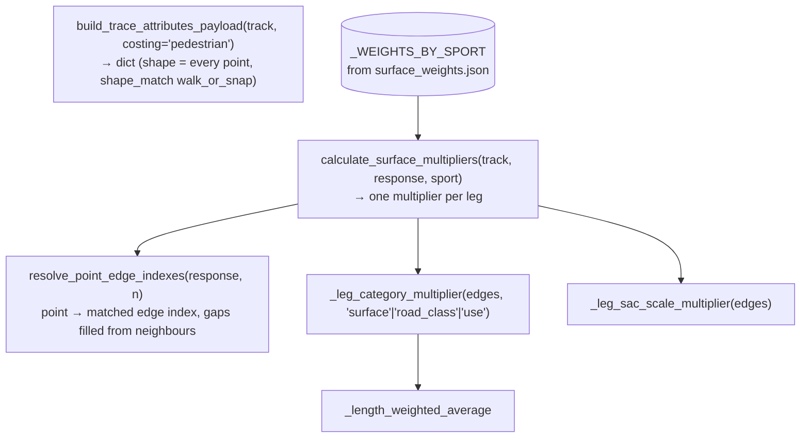

For each leg: `physical = 0.5·surface + 0.3·use + 0.2·road_class`. If the
leg has a SAC scale, one of two things happens:

- The SAC factor replaces `physical` outright when it's severe (≤ 0.85) and
  within 0.25 of `physical`.
- Otherwise, it's blended in: `0.7·sac + 0.3·physical`.

A leg with no matched edge gets 1.0. The HTTP request itself is made in
`pyodideBridge.js`.

### 5.9 `pacing/combine.py`: fitting the model to the anchors

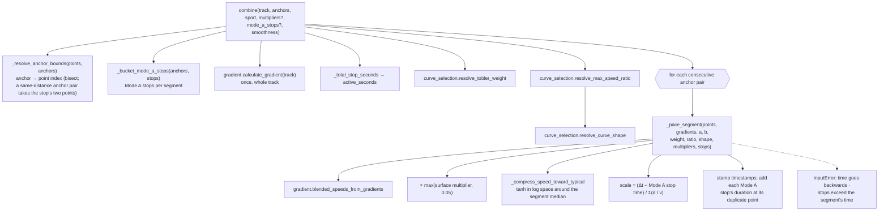

Within one segment, `_pace_segment` does the following, in order:

1. Stamp the first and last points from the two anchors.
2. `v_i` = blended curve speed × surface multiplier.
3. Compress `v_i` toward the segment median with
   `median · exp(L · tanh(ln(v/median) / L))`, where `L = ln(max_ratio)`.
   This is a soft clamp, so it never produces a flat plateau.
4. Modeled time per leg is `d_i / v_i`. Scale all of them so they add up
   to the segment's active time.
5. Walk the legs, adding the time. When the walk crosses a Mode A stop's
   zero-distance leg, add the stop's duration to that point and every later
   point.

Gradients are computed once for the whole track and then sliced per
segment, so smoothing isn't cut off at an anchor.
`tests/tuning/test_model_mirror.py` pins this function's exact output. See
[§10](#10-the-tuning-harness).

### 5.10 `fit_writer.py`

```
write_fit(track) -> bytes
  validate: every point has a timestamp, end > start
  FileIdMessage (manufacturer/product = track.device_manufacturer/_product, or DEVELOPMENT/0 when None;
                 serial only if track.device_serial; product_name = track.device)
  SportMessage (RUNNING | WALKING for hiking)
  Event START
  per point: [Event STOP_ALL + START if zero-distance leg took time]  RecordMessage(lat, lon, alt, distance, speed, ts)
  Event STOP_ALL
  LapMessage + SessionMessage (elapsed, timer = elapsed − paused, distance, ascent, avg/max speed)
  ActivityMessage
  → FitFileBuilder.build_bytes()
```

The per-point speed is recomputed here from the distance and time deltas.
The timer events are what make Strava count stops as stopped rather than as
slow moving time.

### 5.11 `activity_profile.py`

```
build_activity_profile(track, max_samples=1000) -> [ProfileSample]
  bucket legs by ~total_distance/1000 m → one sample per bucket (true distance/time speed)
  a stop leg closes the bucket and emits two zero-speed samples (arrival, departure, is_stop=True)
```

The chart in the GUI only handles presentation. All the reduction happens
here, in Python.

---

## 6. The bridge: `pyodideBridge.js`

This is the only file that talks to Python. It exports four calls and one
helper:

| Export                                  | Python it runs                                 | Returns                                     |
|-----------------------------------------|------------------------------------------------|---------------------------------------------|
| `parseGpx(bytes)`                       | `_track = parse_gpx_bytes(...)`                | `{points, summary}` for the map and sidebar |
| `resolveAnchorCandidates(lat, lon)`     | `nearest_point_candidates(_track, …)`          | 1–4 candidates                              |
| `resolvePhotoAnchors(readings, window)` | `resolve_photo_anchors(_track, …)`             | status per photo                            |
| `convert({...})`                        | the full pipeline ([§8.3](#83-inside-convert)) | `{fitBytes, profile}`                       |
| `classifyPyError(err)`                  | none                                           | tags `InputError`s ([§9](#9-errors))        |

Three mechanisms keep the bridge working:

1. **Lazy startup (`ensurePyodide`).** The first call does all the
   setup:
   - `loadPyodide` from jsdelivr
   - `micropip.install` `gpxpy` and `fit-tool`, pinned to the `uv.lock`
     versions (`GPXPY_VERSION`, `FIT_TOOL_VERSION`)
   - fetch every file in `CORE_FILES` over HTTP from `../../core/`, resolved
     against the bridge module's own URL (`import.meta.url`), so the site
     works whether the repo root or `src/gpx2fit/` is served
   - write them into `/workspace/src` in Pyodide's virtual filesystem, and
     prepend that directory to `sys.path`

   **A `core/` file that isn't in `CORE_FILES` doesn't exist in the
   browser**, and nothing warns about it until an import fails there.
2. **One shared namespace.** Every `runPythonAsync` call runs in the same
   `__main__`. JS passes inputs through `runtime.globals.set(...)`, Python
   leaves its results in globals, and JS reads them back with
   `globals.get(...).toJs(...)`. `_track` stays alive between calls, so a
   GPX file is parsed once and then reused for clicks, photos and every
   conversion.
3. **Serial queue (`enqueue`).** Calls are chained on one promise, so two
   overlapping calls can't overwrite each other's globals. A failed call
   rejects only for its own caller, and the next call in the queue still
   runs. `fetchSurfaceMultipliers` isn't exported and receives `runtime`
   directly, because it runs inside `convert`'s queued task. Queueing it
   again would deadlock.

---

## 7. The GUI

### 7.1 Module dependency graph

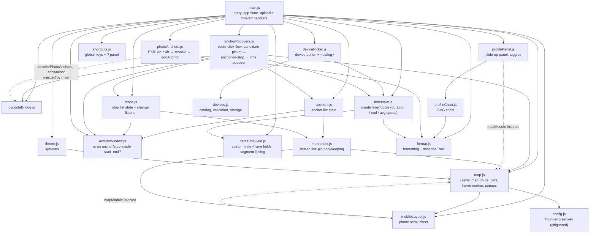

Dependencies are injected in two places. `photoAnchors.js` receives
`resolvePhotoAnchors`, `addAnchor` and `removeAnchor` as arguments rather
than importing them, so its tests can pass in fakes. `profilePanel.js`
receives `mapModule` so it can draw the hover marker. `mobileLayout.js`
receives `mapModule` so it can move the attribution. `map.js` itself imports
only `isPhoneLayout` from it, and `markerList.js` only `revealMap`.

### 7.2 Who owns which state

| State                                              | Owner                                                                                           | Read by                                                                                                                      |
|----------------------------------------------------|-------------------------------------------------------------------------------------------------|------------------------------------------------------------------------------------------------------------------------------|
| route points, total distance, GPX file name, sport | `main.js` (module variables)                                                                    | convert handler; getters passed to `anchorPopovers`, `photoAnchors`, `timeInput`                                             |
| start date/time                                    | `dateTimeField` instance in `main.js`                                                           | `getStartTime()`                                                                                                             |
| duration / end / avg-speed result                  | `createTimeToggle` instance (`startTimeToggle`)                                                 | `startTimeResult` cache and `getResult()` at convert time                                                                    |
| anchors                                            | `anchors.js`, backed by `markerList`                                                            | `getActiveAnchors()` at convert time                                                                                         |
| stops                                              | `stops.js`, backed by `markerList`                                                              | `getActiveStops()` at convert time; `getStops()` for the avg-speed stop total; the change listener refreshes the time toggle |
| activity window (start–end)                        | pushed by `startTimeToggle`'s `onChange` into `anchors.js` and `stops.js` (`setActivityWindow`) | each module's `isInactive` check and `getActive*()`                                                                          |
| parsed `Track`                                     | Python global `_track`                                                                          | every bridge call                                                                                                            |
| theme, surface toggle, smoothness                  | `localStorage`                                                                                  | `theme.js`, `main.js`                                                                                                        |

`main.js` calls `startTimeToggle.refresh()` whenever the average-speed
duration could change: after a GPX parses, on a sport change, and on any
stop change. The convert handler calls `getResult()` again rather than
trusting the cached value.

Every time that toggle's result changes (including a start-time edit),
`main.js` pushes the new `{start, end}` into `anchors.setActivityWindow` and
`stops.setActivityWindow`. Each module re-checks its items with
`activityWindow.js` (strictly inside, the same rule as the photo check).
A window with the same times as before (`sameWindow`) is ignored, and the
re-render (`markerList.refresh`) rebuilds the rows without renumbering the
pins, since a time change can't reorder them. An item outside is kept but marked `.is-inactive`, its pin is dimmed
(`map.setMarkerDimmed`), and it is left out of `getActive*()`. Moving the
window back makes it active again. The convert status then reports how
many were left out (`format.leftOutNote`). An anchor or stop time entered
as "Duration since start" is stored with its offset (`offsetSeconds`, or
`arrival`/`departureOffsetSeconds`), so it follows the start instead of
staying at a fixed clock time. `totalStopSeconds` counts every stop, active
or not: whether a stop is active depends on the end time, which in
avg-speed mode depends on that total.

### 7.3 Interaction flows

Clicking the route:

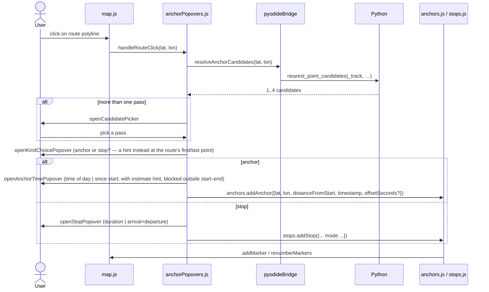

Dropping photos:

```
photoAnchors.handleFiles
  guard: a route is loaded and the start time is valid
  readFile → readPhotoMetadata(file) → exifr: {lat, lon, DateTimeOriginal}
  resolvePhotoAnchors(readings, {startIso, endIso})     (one batch, one bridge call)
  per result: ok → addAnchor({..., source: 'photo'}) · too_far / outside_activity_time / at_route_end → row message only
  afterwards: a start/duration change re-checks the photo anchor like any other (anchors.setActivityWindow)
```

### 7.4 Smaller modules

- **`timeInput.js`**: `createTimeToggle({variant, speedMode?})`.
  - Variants are `durationOrEnd` (the main control), `durationOrTimeOfDay`
    (the anchor popover) and `durationOnly` (a stop's duration).
  - Every mode resolves to `{isValid, mode, resolvedDate, durationSeconds}`.
  - Average-speed mode computes
    `duration = distance / speed + total stop time` in JS.
- **`dateTimeField.js`**: custom date and time fields with quick-pick
  dropdowns. `linkSegmentPair` makes the arrow keys move between the
  hours and minutes boxes.
- **`shortcuts.js`**: each entry in one `SHORTCUTS` array both binds a key
  and renders a row in the "?" panel. Each action calls `.click()` on the
  existing control.
- **`devices.js`**: `DEVICE_CATALOG` (brand → `{name, manufacturer, product}`;
  only IDs with a real source: Garmin from `fit_tool`'s `GarminProduct`, Suunto
  from its own product-ID list, other brands from a recording Strava named or
  another FIT reader's device table: GoldenCheetah, Runalyze) plus pure helpers
  (`selectionLabel`, `parseCustomIds`, `parseStoredSelection`,
  `toConvertDevice`). Tested.
- **`devicePicker.js`**: the sidebar's device button and the native
  `<dialog>` it opens with `showModal()`. Persists the choice in
  `localStorage` (`device`). jsdom has no `showModal`, so it is untested.
- **`profileChart.js`**: pure helpers (`niceTicks`, `linearScale`,
  `buildSeries`, `stopRuns`, `averageMovingSpeedMps`, `linePath`, …) plus
  `createProfileChart`. The pure part has tests.
- **`format.js`**: every formatter, plus `describeError(err) →
  {message, kind: 'input'|'error'}`.
- **`mobileLayout.js`**: the phone layout (`PHONE_LAYOUT_QUERY`, ≤ 860 px,
  kept in step with `styles.css`). The CSS fixes the map full-screen behind
  the sidebar, which becomes a sheet in the page's scroll. The module:
  - opens the page with the sheet half-way up
  - moves `#profilePanel` and `#profileShowButton` to the top of the sheet,
    and moves the Leaflet attribution to the top right
  - `coveredMapHeight()` tells `map.js` how much of the map the sheet hides,
    via `setBottomInsetProvider`. `renderRoute` and `panToMarker` then aim at
    the visible part.
  - `revealMap()` scrolls the sheet back to half-way. It runs after a GPX
    parses and when an anchor or stop row is clicked.

  On phones, `map.js`'s `openAnchorPopup` builds the popover into the
  `#routeDialog` modal instead of a Leaflet popup. The builders in
  `anchorPopovers.js` get the same `(container, close, updateLayout)` either
  way. The layout logic is tested against a stubbed `matchMedia`.

---

## 8. End-to-end code flow

### 8.1 Timeline of one session

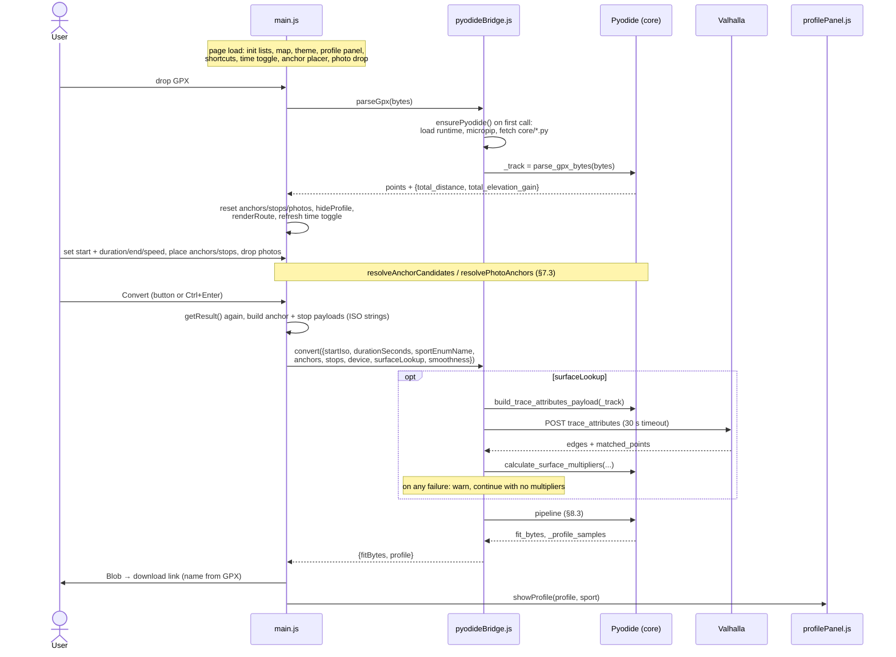

### 8.2 Data flow

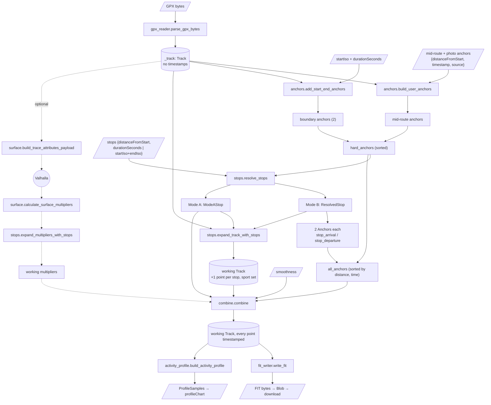

### 8.3 Inside `convert()`

This is the literal order of the Python that `convert()` runs. The bridge
converts JSON and ISO strings into dataclasses first.

1. `boundary = add_start_end_anchors(_track, start, duration=…)`
2. `mid_route = build_user_anchors(_track, raw_anchors, existing_anchors=boundary)`.
   The GUI always sends `distanceFromStart`, so no lat/lon lookup happens
   here.
3. `hard_anchors = sorted(boundary + mid_route)`
4. `resolved_mode_b, mode_a_stops = resolve_stops(_track, raw_stops, hard_anchors)`
5. `all_anchors = sorted(hard_anchors + stop_arrival/departure anchors)`
6. `working_track = Track(expand_track_with_stops(_track.points, all_stops), sport, device, name)`,
   where `device` is `device_name or _track.device` plus the three device IDs.
   They go on the working track, never on `_track`, so clearing the device
   between two conversions of one route really clears it
7. `working_multipliers = expand_multipliers_with_stops(...)` (if surface
   data was fetched)
8. `combine(working_track, all_anchors, sport, working_multipliers, mode_a_stops, smoothness)`
9. `fit_bytes = write_fit(working_track)`
10. `_profile_samples = build_activity_profile(working_track)`, converted
    to camelCase dicts

Surface multipliers are computed against `_track` (not yet expanded), and
only then expanded to match `working_track`. Every conversion builds a fresh
working track, so the same `_track` can be converted any number of times.

---

## 9. Errors

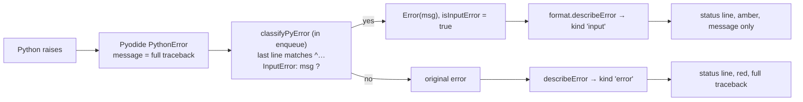

| Raise                         | When                                                                                                                                                                                                                                                                   |
|-------------------------------|------------------------------------------------------------------------------------------------------------------------------------------------------------------------------------------------------------------------------------------------------------------------|
| `InputError`                  | The user can fix it: corrupt GPX, two anchors on one point, a stop on an anchor, departure ≤ arrival, anchor times out of order with distance, stops longer than their segment. Write the message for the user: plain words, real km and times, and a hint at the fix. |
| `ValueError` / `RuntimeError` | A broken internal contract, i.e. a bug between the GUI and `core/`. The traceback is shown so it can be debugged.                                                                                                                                                      |

`combine._describe_anchor` formats an anchor for these messages, for
example "photo anchor at 5.30 km (2026-09-13 14:02)".

---

## 10. The tuning harness

`tuning/` calibrates the pacing constants against real recorded activities.
It's development tooling that runs only on a developer's machine, and it's
documented separately in [TUNING_ARCHITECTURE.md](TUNING_ARCHITECTURE.md).

It touches the app in exactly three places:

- It imports `core/` directly (`gpx_reader`, `gradient`, `curve_selection`,
  `combine`, `anchors`, `models`) and never modifies it. Nothing from
  `tuning/` goes in `CORE_FILES`.
- `tuning/model.py` restates `combine._pace_segment` with the constants as
  arguments. `tests/tuning/test_model_mirror.py` asserts the two produce
  identical timestamps, so a change to `_pace_segment` or the resolvers in
  `curve_selection.py` means updating the mirror.
- What it proposes are new values for constants in `curve_selection.py`,
  applied by hand.

---

## 11. Tests

| Suite           | Location                            | Covers                                                                                                                                                                                                                                                                                                                                                                                    |
|-----------------|-------------------------------------|-------------------------------------------------------------------------------------------------------------------------------------------------------------------------------------------------------------------------------------------------------------------------------------------------------------------------------------------------------------------------------------------|
| pytest, `core/` | `tests/core/`, `tests/core/pacing/` | every `core` module. Shared track builders live in `tests/core/conftest.py`                                                                                                                                                                                                                                                                                                               |
| pytest, harness | `tests/tuning/`                     | see [TUNING_ARCHITECTURE.md §13](TUNING_ARCHITECTURE.md#13-tests)                                                                                                                                                                                                                                                                                                                         |
| node, GUI       | `tests/gui/*.test.js`               | `format`, `dateTimeField`, `timeInput`, `markerList`, `activityWindow`, `anchors` + `stops` (`anchorsAndStops`: the activity-window re-check and `getActive*()`, with `map.js` mocked), `photoAnchors` (incl. `initPhotoDrop`'s per-status rows), `pyodideBridge` (against a fake Pyodide), `shortcuts`, `profileChart`, `devices`, `mobileLayout`. `testUtils/domSetup.js` sets up jsdom |
| untested        | none                                | `map.js`, `anchorPopovers.js`, `profilePanel.js`, `main.js` (Leaflet and popover UI), plus the row/pin rendering side of `anchors.js`/`stops.js`, which have to be checked by hand in a browser                                                                                                                                                                                           |

---

## 12. Change checklists

**Adding a module under `core/`**
- Add it to `CORE_FILES` in `pyodideBridge.js`.
- Keep it free of I/O and native extensions.
- Use `models.py` types.

**Adding a network call**
- Make it from JS (the bridge), never from `core/`.
- Treat a failure as optional if you can.
- Update `about.html#privacy` and the README's privacy table.

**Changing `_pace_segment` or the curve functions**
- Update `tuning/model.py` until `test_model_mirror.py` passes (see
  [TUNING_ARCHITECTURE.md §8](TUNING_ARCHITECTURE.md#8-modelpy-the-pacing-model-with-its-constants-as-arguments)).

**Adding a user-fixable validation**
- Raise `InputError` with a message written for the user.

**Adding a sport**
- Extend `SportType`.
- Add the sport to every `SportType`-keyed table: `TOBLER_THRESHOLDS`,
  `MAX_SPEED_RATIO_BOUNDS` and `surface_weights.json`.
- Update the sport mapping in `fit_writer`.
- Add a segment in the GUI's sport control and update `sportEnumName` in
  `main.js`.
- Cycling also needs its own speed model in `gradient.py`.

**Adding a keyboard shortcut**
- Add one entry to `SHORTCUTS` in `shortcuts.js`. It should `.click()` an
  existing control.

**Adding a persisted setting**
- Wrap the `localStorage` access in try/catch.
- Update the "Only four settings" line in `about.html#privacy`.
