# Tuning harness architecture

How `tuning/` is put together: what each file owns, how a `.fit` recording
becomes a score, and how the search turns scores into proposed constants.
This assumes you know what the pacing model does (see
[ARCHITECTURE.md §5](ARCHITECTURE.md#5-core-module-by-module)). The history
of the corpus gates and of each fit run lives in `CLAUDE.md`, not here.

Contents

1. [Rules](#1-rules)
2. [Package map](#2-package-map)
3. [Module dependencies](#3-module-dependencies)
4. [The data pipeline](#4-the-data-pipeline)
5. [`__main__.py`: the command line](#5-__main__py-the-command-line)
6. [Reading a recording: `cache.py`, `elevation.py`, `fit_reader.py`](#6-reading-a-recording-cachepy-elevationpy-fit_readerpy)
7. [`prepare.py`: making it look like a planned GPX](#7-preparepy-making-it-look-like-a-planned-gpx)
8. [`model.py`: the pacing model with its constants as arguments](#8-modelpy-the-pacing-model-with-its-constants-as-arguments)
9. [`compare.py`: one number per activity](#9-comparepy-one-number-per-activity)
10. [`fit.py`: the search](#10-fitpy-the-search)
11. [`report.py`](#11-reportpy)
12. [The four commands end to end](#12-the-four-commands-end-to-end)
13. [Tests](#13-tests)
14. [Change checklists](#14-change-checklists)

---

## 1. Rules

| Rule | Why |
|---|---|
| **Dev tooling, not part of the converter.** It lives at the repo root, reads files, prints, and makes network calls. Nothing from `tuning/` goes in `backendFiles`. | `core/`'s no-I/O rule exists for Pyodide. The harness never runs in a browser. |
| **numpy here, never in `core/`.** numpy is in the `dev` dependency group only. | Pyodide would have to download it for every user. The harness evaluates the same tracks thousands of times, so it needs the speed. |
| **`core/` is never changed to suit the harness.** | The harness measures the model the app runs. It borrows `core/`'s public functions and restates only what it has to (§8). |
| **The mirror test must pass.** `tests/tuning/test_model_mirror.py` checks that `model.elapsed_from_model` reproduces `combine()` exactly. | Without it the harness silently calibrates a model the app no longer runs. |
| **Only the shape is measured.** | With only a start and an end anchor, `combine()` matches the total time by construction, whatever the constants. The objective scores the residuals minus their mean (§9). |
| **One definition of the score.** The report and the search both go through `compare._evaluate`. | The number a fit minimises is, by construction, the number a report prints. |
| **Cache raw numbers, never judgements.** Only `decode_fit_bytes` output is cached. | Changing a quality gate takes effect on the next run without anyone clearing a cache. |
| **Nothing is guessed.** A sport the file can't map is rejected unless the caller overrides it. A bad file is skipped with a printed reason. | A silently mislabelled or silently dropped activity poisons the corpus without anyone noticing. |
| **No new tests for `tuning/`**, except keeping the mirror test current. | Its output is a proposal a human reads, not a FIT file a user gets. |
| **Corpus and output stay out of git.** `corpus/`, `tuning_out/` and `*.fit` are gitignored. | Real activities contain home GPS positions and heart rate. The decode and DEM caches hold the same positions. |

---

## 2. Package map

```
tuning/
├── __main__.py     CLI: argparse, loads the corpus, one handler per command
├── cache.py        content-hash disk cache of decoded FIT files + process-pool warming
├── fit_reader.py   FIT bytes → DecodedFit (raw arrays) → ReferenceActivity (reading rules)
├── elevation.py    --dem-elevation: swap missing/noisy elevation for Valhalla /height
├── prepare.py      ReferenceActivity → PreparedActivity (moving time, gates, resample, GPX)
├── model.py        PacingParams, TrackModel, the mirror of combine._pace_segment
├── compare.py      ActivityContext, bucket residuals, objective, ActivityReport
├── fit.py          sweep_activity (per activity), fit_constants (corpus search)
└── report.py       ActivityReport → text table / JSON

tests/tuning/       pytest; conftest.py builds synthetic recordings with a known response
corpus/             your real .fit files (gitignored), optionally sports.json / trims.json
tuning_out/         everything written (gitignored): decoded/, elevation/, reports, proposals
```

---

## 3. Module dependencies

Arrows point from the importer to what it imports.

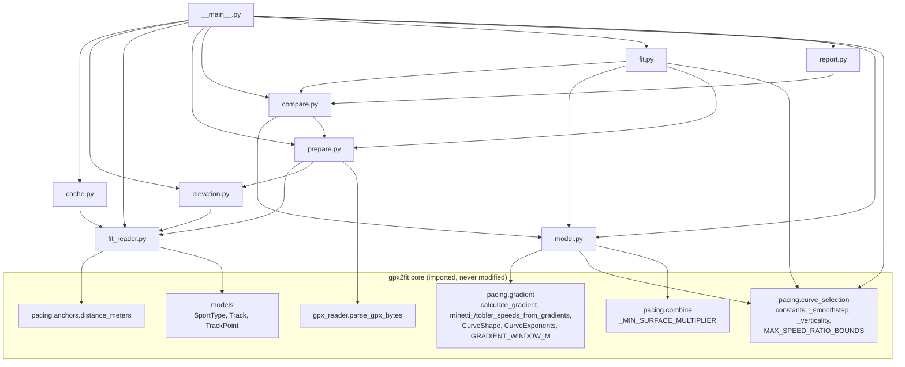

`fit_tool` is imported only by `fit_reader.py` (decoding). numpy is used by
`fit_reader`, `cache`, `elevation`, `prepare`, `model` and `compare`.

---

## 4. The data pipeline

Each step produces one type. The types are the seams, and each is built by
exactly one function.

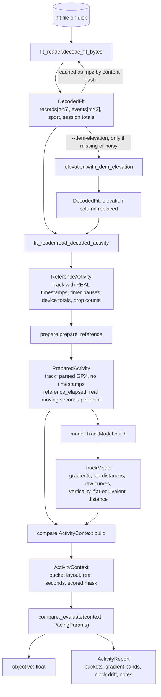

What each type is for:

| Type | Built by | Holds | Depends on `PacingParams`? |
|---|---|---|---|
| `DecodedFit` | `fit_reader.decode_fit_bytes` | raw numbers only, NaN where absent | no (cacheable) |
| `ReferenceActivity` | `fit_reader.read_decoded_activity` | points with real timestamps, pauses, sport | no |
| `PreparedActivity` | `prepare.prepare_reference` | the production-shaped track plus the real answer | no |
| `TrackModel` | `model.TrackModel.build` | everything about the track that no knob can change | only `gradient_window_m` |
| `ActivityContext` | `compare.ActivityContext.build` | `TrackModel` plus bucket layout and real times | only `gradient_window_m` |
| `ResolvedSettings` | `model.resolve` | the three per-workout decisions plus the features | yes |
| `ActivityReport` | `compare.report_of` | everything a human reads for one activity | yes |

Everything above the `PacingParams` line is computed once per activity, and
everything below it once per evaluation. That split is where the speed
comes from: a fit makes thousands of evaluations and never repeats the
upper half.

---

## 5. `__main__.py`: the command line

### 5.1 Dispatch

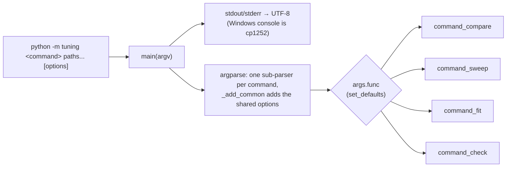

Each sub-parser stores its handler with `set_defaults(func=...)`, so
`main` ends with `return args.func(args)` and there is no if/elif chain.
The return value (0 or 1) becomes the exit code. `main(argv)` takes an
optional list so it can be called directly.

Shared options (`_add_common`): `paths`, `--trims`, `--trim-ends`,
`--params`, `--bucket`, `--spacing`, `--out-dir`, `--sport`, `--sports`,
`--cache-dir`, `--no-cache`, `--workers`, `--dem-elevation`.

Command-specific options:
- `compare`: `--json`, `--dump-gpx`
- `fit`: `--rounds`, `--holdout`, `--seed`
- `check`: `--baseline`, `--write-baseline`, `--tolerance`

### 5.2 Loading the corpus

Every command starts with `_activities_from(args)`, which calls
`_load_activities`. That function is the shared first half of every run.

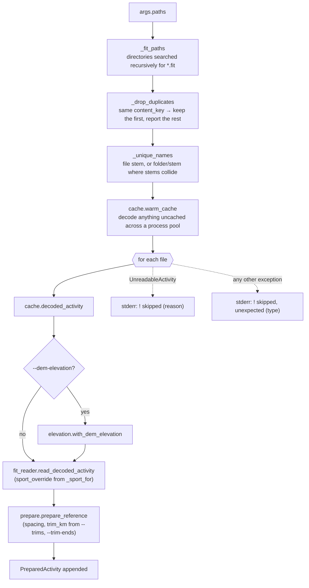

- **Names are keys, not labels.** `check` stores one score per name and
  `compare --json` writes one file per name, so two `export1.fit` files in
  different folders must not collide. Only the colliding ones get the folder
  prefix.
- **Sport override order** (`_sport_for`): the file's own stem in
  `sports.json`, then each folder on its path (nearest first), then the
  blanket `--sport`, then `None`, meaning trust the file.
- **`--trims` lookup** tries the qualified name first, then the bare stem, so
  a trims file written before a name needed qualifying still applies.
- **Two kinds of skip.** `UnreadableActivity` is an expected rejection (bad
  data). The catch-all is for bugs, so one strange file can't kill a corpus
  run. Both go to stderr, so `> report.txt` keeps the reports clean while
  the reasons still show in the terminal.

### 5.3 Loading constants

`_params_from(path)` returns `PacingParams()` (the shipped constants) when no
file is given. Otherwise it reads the JSON and uses its `"global"` key if
there is one, so `fit`'s own `proposed.json` can be fed back in.

Known gap: it ignores `"per_sport"`. Running `compare --params
tuning_out/proposed.json` applies the fitted global knobs only, not the
per-sport fills and ratios. To check per-sport results, write a params file
with those values at the top level and run each sport separately.

---

## 6. Reading a recording: `cache.py`, `elevation.py`, `fit_reader.py`

### 6.1 Why reading is split in two

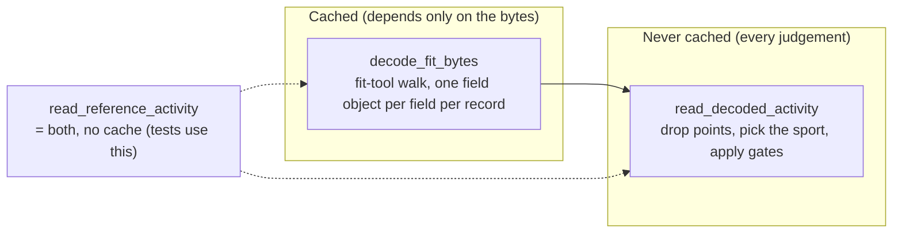

Decoding costs orders of magnitude more than everything else. It extracts
raw numbers and nothing else, so its result can be stored and trusted
forever. Every rule about those numbers stays on the uncached side.

### 6.2 `cache.py`

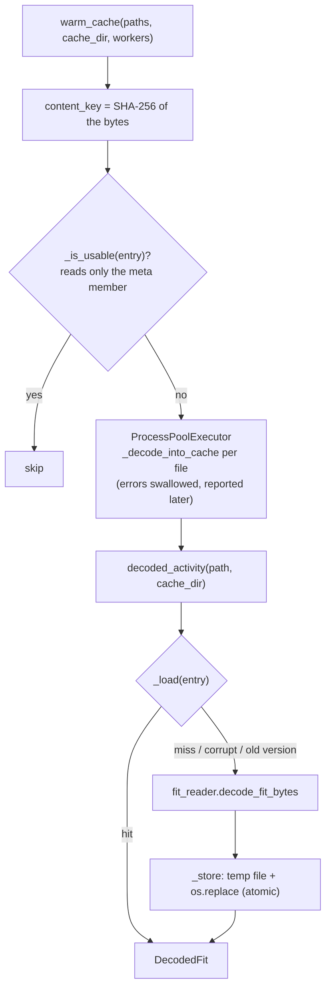

- Entries are `tuning_out/decoded/<sha256>.npz`. A renamed or re-exported
  file hits the same entry; an edited file gets a new one. Nothing is
  invalidated by hand.
- `_FORMAT_VERSION` is the one manual switch: bump it when
  `decode_fit_bytes` changes what it extracts. Old entries are then ignored
  and overwritten.
- Processes, not threads: decoding is pure Python and holds the GIL.
  `_decode_into_cache` is module-level so Windows' spawn start method can
  import it.
- A worker that fails swallows the error. The main loop then hits the same
  file in `decoded_activity`, where the failure is reported against the
  right activity, in order.
- `--no-cache` passes `cache_dir=None`, which decodes every file directly
  and skips warming.

### 6.3 `elevation.py` (`--dem-elevation`)

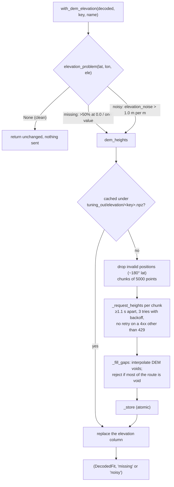

`elevation_noise` is the median of `|Δelevation| / leg length` over legs of
at least 0.5 m. It's a median of per-leg ratios so a genuine climb (on some
legs) can't read as noise (on every leg). `prepare._check_quality` uses the
same function and threshold, so a file this module would fix is exactly a
file the gate would otherwise reject.

This is the harness's only network call, and it sends recorded positions
to a third party. That's why it's opt-in and why clean files are never
sent.

### 6.4 `fit_reader.py`

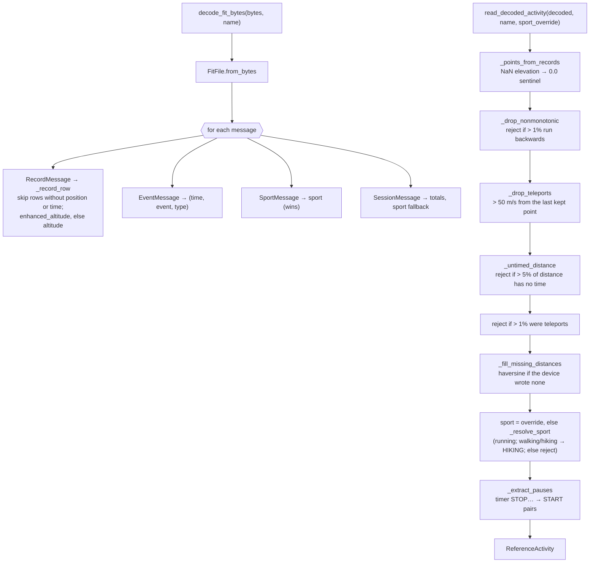

The order matters in two places:
- Backward timestamps are dropped before teleports, because
  `_drop_teleports` assumes time only moves forward.
- The untimed-distance share is checked before the teleport share. A batch
  of records sharing one timestamp gets a 1 s floor in `_drop_teleports`, so
  ordinary GPS scatter inside the batch reads as 50+ m/s. Checking the
  batch first reports the real problem.

The 50 m/s teleport threshold sits far above `prepare`'s 10 m/s spike gate on
purpose. A genuinely fast stretch (a car ride in a mislabelled recording)
must reach the spike gate and get the whole activity rejected, rather than
be patched out one point at a time.

`distance_from_start` here is provisional (the device's own, or haversine).
`prepare` replaces it by round-tripping through GPX.

---

## 7. `prepare.py`: making it look like a planned GPX

A real FIT has barometric elevation every ~3 m. A real uploaded GPX has DEM
elevation in whole metres every 10–50 m. The two give different gradients
through the 70 m window, so the harness reshapes each recording into what
production actually receives.

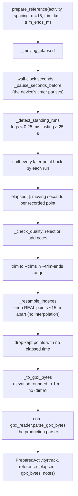

`_check_quality` rejects, in order:

| Gate | Rejects when | Fix |
|---|---|---|
| points | fewer than 50 | none |
| distance | under 500 m | none |
| moving time | under 120 s after stops are removed | none |
| elevation missing | over 50% of points at the 0.0 sentinel, or elevation never changes | `--dem-elevation` |
| elevation noisy | `elevation_noise` over 1.0 | `--dem-elevation` |
| dropouts | gaps over max(30 s, 10 × median leg time) total over 10% of moving time | none |
| GPS spikes | over 2% of legs faster than 10 m/s | none |

Anything short of rejection becomes a note, including a >10% mismatch
against the device's own distance. Notes are carried into every report, so
a suspect activity stays visible.

Why the round trip through GPX: `distance_from_start` is cumulative 3D
distance (gpxpy's `distance_3d`), so gradients are rise over slope distance.
Parsing real GPX makes the harness match production by construction instead
of by reimplementation. `compare --dump-gpx` writes the same bytes out, so
an activity can be loaded into the browser GUI for a visual check.

Why stops are removed: stops are their own mechanism in the app. The
harness measures only the moving-pace curve, so `reference_elapsed` is
moving time, and the model is paced as one segment with no stops.

---

## 8. `model.py`: the pacing model with its constants as arguments

`core/` reads its constants as module globals, and `gradient.py` snapshots
some of them at import, so they can't be monkeypatched reliably. `model.py`
restates the parts of `combine._pace_segment` that read those constants, with
every constant taken from a `PacingParams` instead.

### 8.1 What is borrowed and what is restated

| In `core/` | In `model.py` | Borrowed or restated |
|---|---|---|
| `gradient.calculate_gradient` | called in `TrackModel.build` | borrowed |
| `minetti_speeds_from_gradients`, `tobler_speeds_from_gradients` | called once per track at exponent 1.0 (`raw_minetti`, `raw_tobler`) | borrowed |
| `gradient._soften` (`raw ** exponent`) | `_blended.softened` | restated (trivial) |
| `blended_speeds_from_gradients` | `_blended` | restated over the raw curves |
| `curve_selection.resolve_tobler_weight` | `tobler_weight_for` | restated, thresholds from params |
| `curve_selection.resolve_max_speed_ratio` | `max_speed_ratio_for` | restated, bounds from params, no smoothness |
| `curve_selection.resolve_curve_shape` | `curve_shape_for` | restated, fills and reference grade from params |
| `_smoothstep`, `_verticality` | imported | borrowed |
| `combine._compress_speed_toward_typical` | `_compressed` | restated in numpy |
| `combine._pace_segment` scaling | `elapsed_from_model` | restated, single segment only |

So a change to the Minetti polynomial or Tobler's slope factor reaches the
harness on its own. A change to how speeds are softened, blended, bounded
or scaled does not, and the mirror test will catch it.

### 8.2 Call graph

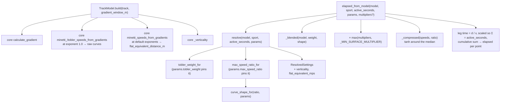

`PacingParams` is a frozen dataclass whose defaults are the shipped
constants, so `PacingParams()` means "the model as it ships" and every fit
result is a diff against it. Two of its fields bypass the resolvers:
`tobler_weight` and `max_speed_ratio` pin those decisions directly, which is
how `sweep_activity` works. `ratio_flat`, `ratio_hilly`,
`tobler_flat_equivalent_mps` and `tobler_verticality` default to `None`,
meaning "use the sport's shipped table value".

`gradient_window_m` is the only field that changes the gradients themselves.
A `TrackModel` records the window it was built for, and anything reusing
one must check it (see §9).

Smoothness is absent on purpose. It's a user preference that scales the
ratio, not something to calibrate, so the harness always works at level 5
(scale 1.0).

---

## 9. `compare.py`: one number per activity

### 9.1 Why buckets and logs

- Per-point timestamp error can't work as the measure: with only start and
  end anchors the total is matched by construction.
- At 1 Hz a leg is ~3 m and its speed is mostly GPS jitter. Residuals are
  taken over distance buckets of at least `max(--bucket, gradient window)`,
  70 m by default. Below the smoothing window the model claims nothing.
- The residual is `log(model_speed / real_speed)` per bucket. Log space is
  where the model works, and it makes 12% too fast and 12% too slow the same
  size.

### 9.2 Call graph

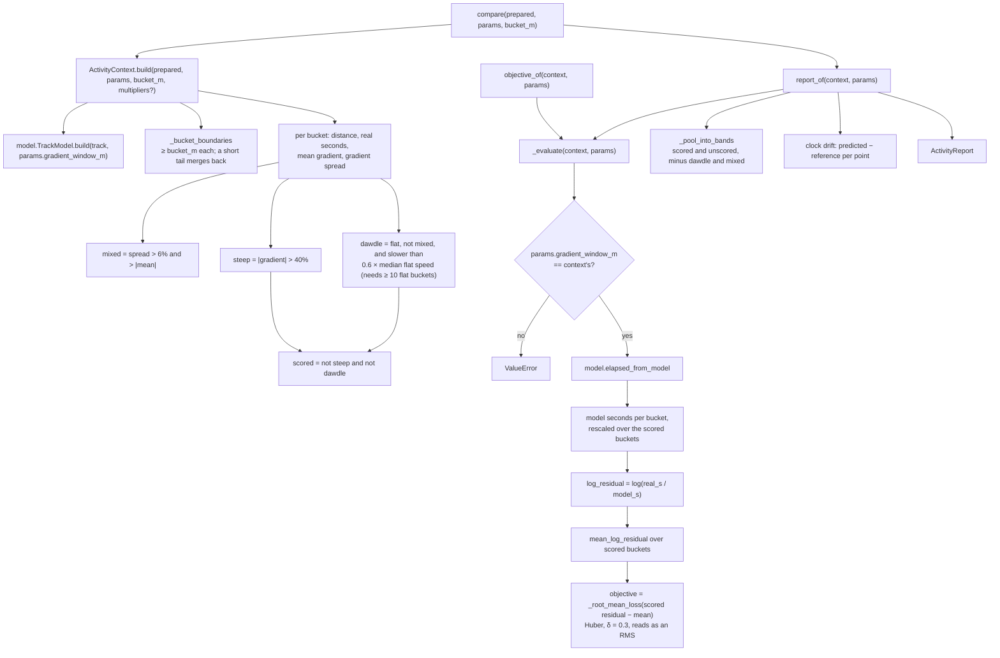

### 9.3 What each bucket flag does

| Flag | Paced? | In the objective? | In the band table? | Meaning |
|---|---|---|---|---|
| `steep` (>±40%) | yes | no | own outer rows | almost always bad elevation data |
| `dawdle` | yes | no | no | slow flat ground the device didn't pause for |
| `mixed` | yes | yes | no | slope changes direction inside the bucket, so its mean gradient misrepresents it |
| none | yes | yes | yes | normal |

Unscored buckets are still paced, exactly as the app would pace them.
Because the objective subtracts the mean residual, the time the model gives
them can't shift the score: no uniform offset can, including the Jensen gap
from matching total time.

### 9.4 Three entry points, one computation

| Function | Returns | Used by |
|---|---|---|
| `compare(prepared, params, bucket_m)` | `ActivityReport` | `command_compare`, `command_check` (one call per activity) |
| `report_of(context, params)` | `ActivityReport` | `compare`, and `sweep_activity` for the baseline row |
| `objective_of(context, params)` | `float` | `fit._Evaluator`, `sweep_activity` (thousands of calls) |

All three go through `_evaluate`. The fit's `train_after`, the `objective`
line of a `compare` report and `check`'s baseline are therefore the same
quantity, and after a fit, `compare --params` shows where in the gradient
bands the improvement came from.

`ActivityReport.mean_log_residual` sits near zero and isn't a finding:
being too fast in one band forces being too slow in another. Read the
`shape` column of the band table, not `resid`.

---

## 10. `fit.py`: the search

### 10.1 Two stages

- **Stage one, `sweep_activity`** (diagnostic). Pins `tobler_weight` and
  `max_speed_ratio` directly, bypassing the resolvers, and finds the pair
  this one activity scores best at. It reports what the activity wanted next
  to what the resolvers gave it. Stage two does not read it.
- **Stage two, `fit_constants`** (the fit). Searches the constants shared by
  every activity of a sport, on a training split, and reports a held-out
  split to show whether they generalise.

One activity's optimum is not the right constant. An athlete who faded on
the last climb "wants" a bound the terrain doesn't justify, which is why
stage two fits shared constants.

### 10.2 `sweep_activity`

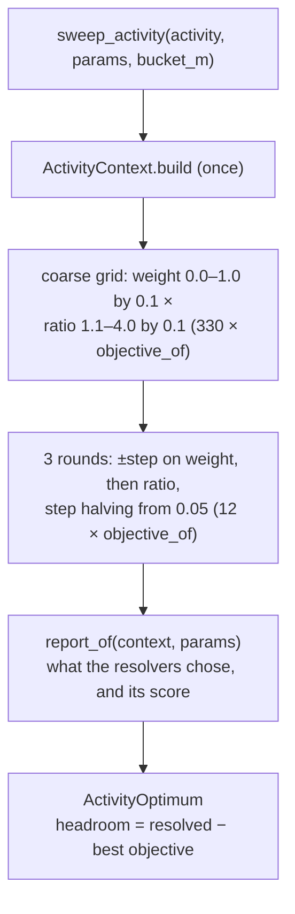

Reading the result: high headroom means the resolvers picked the wrong
weight or bound. A high best objective with low headroom means no weight or
bound can fix it, so the curve shape (the fills) is what's wrong.

### 10.3 `fit_constants`

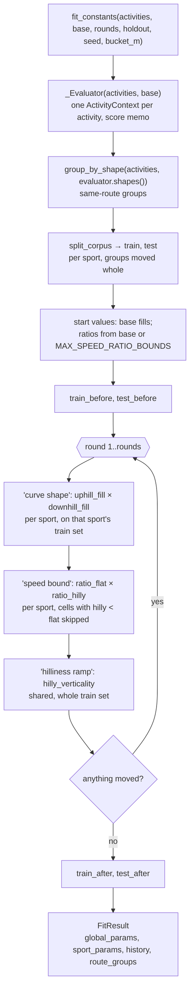

Each stage calls `_search_block`, and each block's step is recorded as a
`StageStep` (values, whether it moved, training objective, plateau).

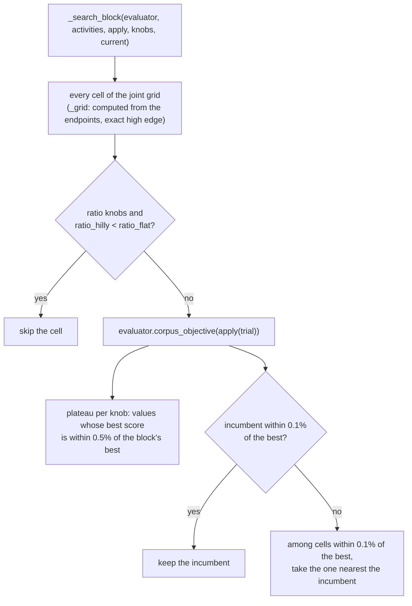

Why it's built this way:

| Choice | Reason |
|---|---|
| Grid search | The objective is only piecewise smooth (medians, smoothsteps, tanh), one evaluation takes milliseconds, and a full grid shows how flat the optimum is. |
| Blocks searched jointly | Knobs in a block trade off, so a one-at-a-time search stalls. The two ratios share a block so `ratio_hilly ≥ ratio_flat` only removes cells instead of deadlocking. |
| Fills per sport | Shared fills let the running-heavy corpus flatten hiking's curve. |
| `MIN_GAIN_SHARE` (0.1%) | A block moves only for a real gain, so a knob the corpus can't see stays put instead of drifting to whichever cell iteration order reached first. |
| Plateau (0.5%) | Shows how firmly the corpus pins a value. A plateau spanning the whole range means the corpus doesn't constrain that knob. |
| Not fitted: `curve_reference_grade` | It only rescales what the fills set, so the two slide along a ridge of equal scores. |
| Not fitted: `hilly_verticality_band` | A corpus this size can't tell a wide ramp from a narrow one. |

### 10.4 The evaluator and the split

- **`_Evaluator`** builds every `ActivityContext` once, for
  `base.gradient_window_m`. `objective` memoises on `(name, PacingParams)`;
  `PacingParams` is frozen and hashable, and descent revisits cells
  constantly. `corpus_objective(params_for, activities)` is the
  distance-weighted mean, so a long mountain day counts for more than a
  short jog. `params_for` is a `SportType → PacingParams` callable, which is
  how per-sport values reach each activity.
- **`group_by_shape`** clusters activities of the same sport whose
  `(distance, verticality)` sit within an ellipse (`_shape_gap ≤ 1`:
  ~8% distance, ~0.012 verticality). Complete linkage, so a dense range of
  6, 6.5, 7, 7.5 km runs can't chain into one blob. Shape, not start
  location, because shape is what the model sees.
- **`split_corpus`** works per sport: groups are shuffled with the seed, and
  each goes to test only if that brings the held-out count closer to the
  target. A sport always keeps at least two training activities.
- **`FitResult.boundary_hits`** lists every value that settled on the edge
  of its search range, plus `ratio_hilly == ratio_flat`. An edge value is a
  floor or ceiling, not an answer.

---

## 11. `report.py`

Presentation only. `format_report` renders one `ActivityReport` as the text
block a human reviews: header with terrain features and resolved settings,
notes, objective, unscored and mixed distance, clock drift, the gradient-band
table (`model`, `real`, `resid`, `shape`) and the worst few buckets.
`report_to_dict` produces the full JSON (open-ended bands are written as
`null`, not `inf`). `write_json` creates parent directories.

It imports the scoring constants from `compare.py` only to print them in the
legend, so the explanation can't drift from the rule.

---

## 12. The four commands end to end

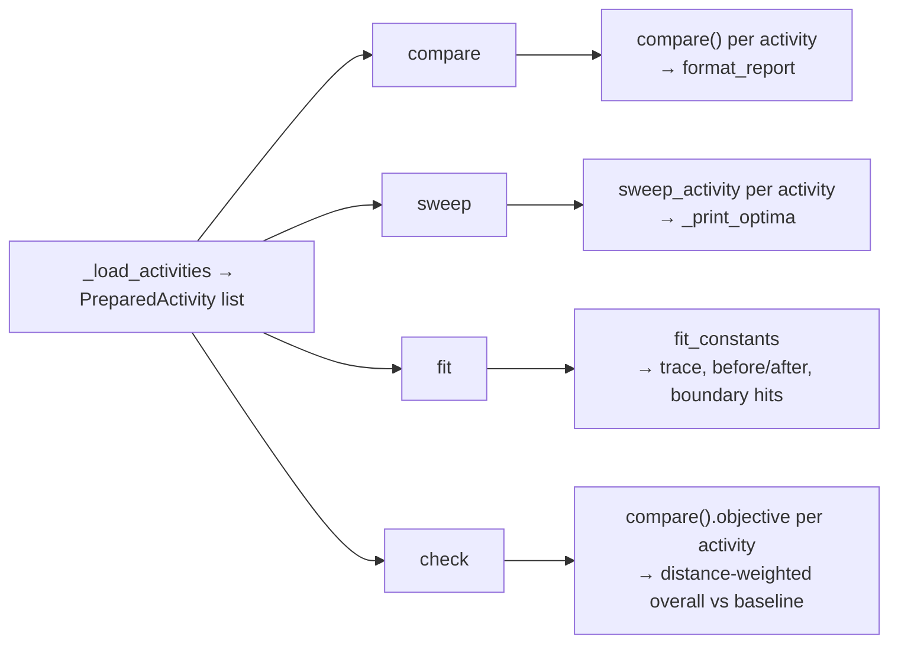

| Command | Calls | Prints | Writes (under `--out-dir`, default `tuning_out/`) | Exit code |
|---|---|---|---|---|
| `compare` | `compare` once per activity | one report block each | `activities/<name>.json` with `--json`, `gpx/<name>.gpx` with `--dump-gpx` | 0 |
| `sweep` | `sweep_activity` per activity | the optimum table (got vs want, headroom) | `optima.json` | 0 |
| `fit` | `fit_constants` once | split sizes, before/after, "memorising" warning if held-out gained under 40% of train's gain, same-route groups, per-stage trace with plateaus, changed constants, boundary hits | `proposed.json` (global, per_sport, history, split) | 0 |
| `check` | `compare` once per activity | overall before → after, regressed activities | `baseline.json` on first run or with `--write-baseline` (path from `--baseline`) | 1 if overall worsened by more than `--tolerance` (0.002) |

All four return 1 with "No usable activities." if nothing survived loading.
`fit` output is a proposal, not a patch: the fills are fitted per sport, but
`core/` has one `UPHILL_FILL` and one `DOWNHILL_FILL`, so shipping
different values per sport would need a per-sport table in
`curve_selection.py`.

Surface multipliers: `compare`, `ActivityContext` and `elapsed_from_model`
all accept them, but no command passes any yet. Tuning the surface weights
needs a Valhalla `trace_attributes` fetch per corpus activity, which isn't
built.

---

## 13. Tests

| File | Covers |
|---|---|
| `conftest.py` | `synthetic_activity` / `synthetic_fit_bytes` build recordings on rolling terrain with a known gradient response, written through `core`'s own `fit_writer`; `with_standing_pause` adds an unpaused stop |
| `test_model_mirror.py` | **load-bearing**: `elapsed_from_model` at default `PacingParams` equals `combine()`'s timestamps, and `resolve` equals core's resolvers, across both sports and three terrains |
| `test_fit_reader.py` | sport mapping, round trip of a file this project wrote, pause extraction, rejections |
| `test_prepare.py` | resampling, elevation rounding, reference timing, stop removal, trimming, GPX round trip |
| `test_compare.py` | a self-consistent activity scores zero, a planted uphill weakness shows up, bucketing and bands |
| `test_fit.py` | sweep bounds and headroom, split stratification and reproducibility, fit improves training, ratio ordering, boundary hits |

Policy (from `CLAUDE.md`): keep these passing, don't add more, except that
the mirror test must be updated whenever `_pace_segment` changes.

---

## 14. Change checklists

**Changed `combine._pace_segment` or anything in `curve_selection` it calls**
- Run `uv run pytest tests/tuning/test_model_mirror.py`.
- Update the matching function in `model.py` (§8.1) until it passes.

**Added a new tunable constant in `core/`**
- Add a field to `PacingParams` defaulting to the core constant.
- Read it from `params` in the mirrored function.
- To fit it, add it to a `Stage` in `STAGES` with a range wide enough to
  contradict today's value. Keep each block to one or two knobs.
- If it's per sport, add it to the starting values in `fit_constants`.

**Added or changed a quality gate**
- Put reading rules (which points to drop) in `read_decoded_activity`, and
  judgements about the prepared activity in `prepare._check_quality`.
- Raise `UnreadableActivity` with the file name and the measurement that
  failed.
- No cache clear is needed.

**Changed what `decode_fit_bytes` extracts**
- Bump `cache._FORMAT_VERSION`. Update `RECORD_COLUMNS` if columns moved,
  since `elevation.py` patches by column.

**Changed the DEM source or what is cached for it**
- Bump `elevation._FORMAT_VERSION`.

**Added a sport**
- Add it to `_FIT_SPORT_TO_SPORT_TYPE` if FIT has a matching value.
- `TOBLER_THRESHOLDS` and `MAX_SPEED_RATIO_BOUNDS` in `core/` need entries
  first; the harness reads both.

**Added a command**
- Write `command_<name>(args) -> int`, add a sub-parser with
  `_add_common` and `set_defaults(func=...)`.
- Start from `_activities_from(args)` so it gets the same loading, skips and
  caches as every other command.
